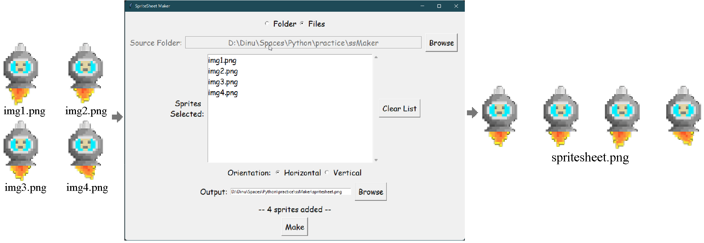
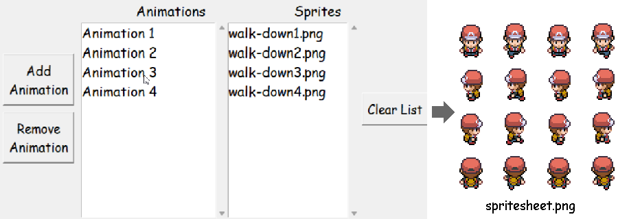
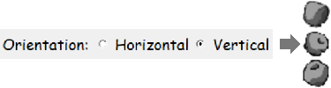

# SpriteSheet Maker

> **to combine your 2d sprites into a single sprite-sheet**

- - -

## Table of Contents

1. [What is SpriteSheet Maker](#what-is-spritesheet-maker)
1. [How to Use](#how-to-use)
1. [Features](#features)
1. [Contribute](#contribute)
1. [BackStory](#little-backstory)

- - -

## What is SpriteSheet Maker

It's not too long before 2D gamedevs come to a point where their fantastically working game needs some visual aesthetic. This is where 2D art comes into play. Several frames of 2D art are displayed rapidly, which is what we call *animation*. But as the project grows, it becomes difficult to manage all those images in the growing file system; that's why artists put all those frames of a single animation together into a single image, which is then retrieved via game engines.

This ***SpriteSheet Maker*** does exactly that- **takes all your sprites and put them into a single image file.** This is beneficial for amateur game-devs who prefer to use lightweight image editing apps like [*Paint.net*](https://www.getpaint.net/), which doesn't provide that feature of combining.

- - -

## How-to-Use

Well, the interface is very intuitive, but for the sake of completeness, here's the way:

* Images can be selected via opening a *Folder* containing only the sprites, or opening one or more sprites with the *Files* option, or both.

    

* Multiple animations can be added, via the *Add Animation* button and *Remove Animation* button. Sprites of each of them would go to a new line of images.

    

* Selecting the orientation- *horizontal* or *vertical*- would align the sprites accordingly.

    

* After Selecting all the images and choosing the *output location and name*, just click *Make* button and Voilah!

- - -

## Features

The below given features summarizes what this whole project is all about. A more detailed description of all the UI-level and low-level features can be checked out here on this project's [features.md](./features.md) file.

1. Option to output sprites of **multiple animations** into a single sprite-sheet image. Each animation would be put on a new line of images.

2. Option to **orient the animations** either *horizontally* or *vertically*.

- - -

## Contribute

This project is far from significant. I have a lot of features in mind, which can be checked out here at this [Project's Wiki](https://github.com/lightRajat/SpriteSheet-Maker/wiki). People would be highly appreciated for their contributions to grow this project.

- - -

## Little BackStory

**Hey Readers!** Thanks for using this application. This project was made while digressing from making games. I started making games, which you can check out here on my [Itch.io Page](https://lightrajat.itch.io/). I was just an amateur and used [paint.NET](https://www.getpaint.net/) to make my sprites, resisting to use the feature-loaded [GIMP](https://www.gimp.org/). But paint.NET didn't have any feature to combine the sprites. So, I made this project.

> :heart_on_fire: Made with Passion and Love :heart_on_fire: